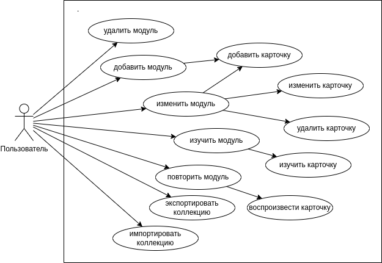
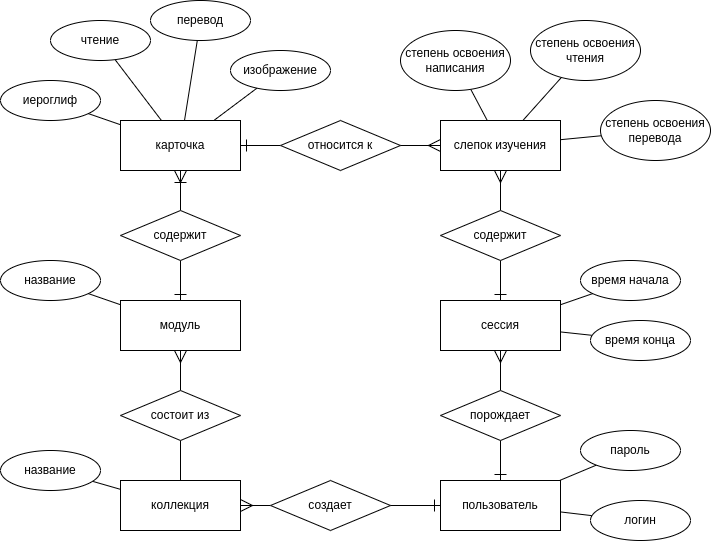

# Kanki

Программа для изучения иероглифики.

Идея в том, чтобы создать приложение, которое бы позволяло изучать восточные языки с учетом специфики изучения иероглифов (чтение и перевод).

---

## Предметная область

**Карточка** - сущность, описывающая отдельный иероглиф или слово, связывающее его с переводом и транскрипцией для его чтения. Каждая карточка может быть создана только в контексте какого-либо модуля.

**Модуль** - набор карточек объединенных по смыслу. Модуль содержится в коллекции, имеет собственное название (должно быть уникальным в рамках коллекции). Модуль может быть создан в рамках конкретной коллекции.

**Коллекция** - набор модулей. По-умолчанию, в программе имеется одна стандартная коллекция, но по необходимости, может быть импортирована/экспортирована в файл.

**Слепок изучения** - сущность, хранящая текущий прогресс изучения по конкретной карточке. Прогресс описывается степенью знания чтения и степенью знания перевода (по-отдельности).

**Сессия** - сущность, хранящая информацию о текущих действиях. Создается каждый раз при первом изучении или повторении определенного модуля после запуска приложения.

*Характеристика карточки* - написание иероглифа, его чтение или перевод.

*Уровень знания* - неотрицательное число, присваиваемое характеристикам карточек. Больший уровень знания означает больший период повторения.

*Период повторения* - количество дней, по истечению которых карточка будет готова к повторению.

---

## Процесс обучения

Если в модуле содержатся не готовые к повторению карточки, то доступна опция "изучения".

**Изучить модуль** - показать новые карточки из модуля (не готовые к повторению) для запоминания. Написание, чтение и перевод показываются одновременно. После показа карточки, ее характеристикам назначается *уровень знания*, а сама карточка становится готовой к повторению.

**Повторить модуль** - показать карточки, готовые к повторению. Во время повторения показывается только одна характеристика карточки, а другая должна быть воспроизведена пользователем. Для пользователя доступна кнопка для отображения второй характеристики, а также 3 кнопки для субъективной оценки собственного знания воспроизводимой характеристики, а именно:

* **[Легко]** - уровень знания характеристики повышается на 2;
* **[Трудно]** - уровень знания характеристики повышается на 1;
* **[Не помню]** - уровень знания характеристики устанавливается в 0.

## Расчёт периода повторения

Период повторения зависит от уровня знания согласно следующей формуле:

$$T(p) = \lfloor\exp\left(\frac{p}{1.42}\right)-1\rfloor$$

---

## Анализ аналогичных решений

| Критерий | Kanki | Anki | Quizlet | Memrise |
| --- | --- | --- | --- | --- |
| Зона для тренировки написания | + | - | - | - | 
| Отдельные поля для иероглифа, чтения и перевода | + | - | - | - |
| Отдельное поле для примеров | + | - | - | + |
| Обучение в группах (возможный контроль преподавателя) | - | - | + | + |
| Ориентированность на самостоятельное изучение | + | + | - | + |

---

## Актуальность проекта

В современных реалиях сближения с восточными странами, в частности с Китаем, повышается ценность специалистов различных областей, владеющих китайским языком. Сложнейшим этапом изучения китайского, японского и корейского языков является иероглифика, однако приложения для изучения иностранных слов не предоставляют интерфейс, который был бы эффективен конкретно для изучения иероглифов. Разрабатываемое ПО стремится решить данную проблему, облегчив изучение иероглифики. 

---

## Use-Case диаграмма

---

## ER-диаграмма

---

## Архитектурные характеристики, важные для проекта

* Сохранение состояния в любой момент времени. Сессия должна сохранятся при любом завершении приложения.
* Легкость модификации. В будущем можно сделать группы для обучения, онлайн базу модулей для изучения, делиться прогрессом с друзьями. А также например, добавить возможность прослушать чтение (с использованием стороннего сервиса озвучки, например, гугл/яндекс переводчик).
